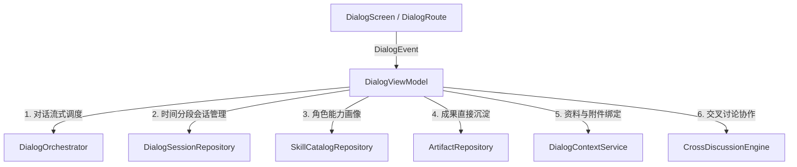

# 见域「对话」Top 1 核心页面——底层接口需求与预留对接文档

> **文档定位**：供后续负责底层数据模型、DAO、Repository、ViewModel 及协调器（Orchestrator）开发的 AI 直接参考。  
> **关联 UI 页面**：[`app/src/main/java/com/elio/jianyu/ui/screens/dialog/`](file:///D:/My_Elio/AI-Skill-Roundtable/app/src/main/java/com/elio/jianyu/ui/screens/dialog/)  
> **视觉设计依据**：[`docs/product/重构/UI界面/对话/jianyu-dialog-final-ui-spec.md`](file:///D:/My_Elio/AI-Skill-Roundtable/docs/product/%E9%87%8D%E6%9E%84/UI%E7%95%8C%E9%9D%A2/%E5%AF%B9%E8%AF%9D/jianyu-dialog-final-ui-spec.md)

---

## 1. 概述

见域 Top 1 核心页面「对话」UI 层已全面重构完成。UI 层严格遵循单向数据流架构，通过 [`DialogUiState`](file:///D:/My_Elio/AI-Skill-Roundtable/app/src/main/java/com/elio/jianyu/ui/screens/dialog/DialogUiState.kt) 消费状态，通过 [`DialogEvent`](file:///D:/My_Elio/AI-Skill-Roundtable/app/src/main/java/com/elio/jianyu/ui/screens/dialog/DialogEvent.kt) 分发用户操作事件。

为了使后续负责底层业务实现的 AI 能够精准无缝对接，本文档详细梳理了当前 UI 所依赖并预留的 **7 大底层接口需求清单**。

---

## 2. 预留底层接口清单与契约



---

### 2.1 多角色独立流式生成与点名回复调度接口

#### 业务背景
在多角色对话中，用户发送消息后：
- **默认模式**：当前会话中已加入的全部平级 Skill 角色（如规划教练、系统思考者）分别独立并发或顺次作答，角色互不强行引用；
- **点名模式（@ 角色）**：仅指定的单角色生成回复；
- **多角色模式**：明确让选定的多个角色分别回复。

#### 建议接口契约
```kotlin
interface DialogOrchestrator {
    /**
     * 发送用户消息并触发多角色独立作答
     * @param sessionId 当前会话 ID
     * @param userText 用户输入正文
     * @param targetSkillId 点名回复的单角色 ID（为空表示按会话配置或全部角色）
     * @param isMultiRoleAnswer 是否为“多个角色分别回答”
     * @param searchEnabled 是否开启联网搜索
     * @param thinkingIntensity 思考强度（如“标准”、“深度”）
     * @return 包含各个角色独立流式事件的 Flow
     */
    fun sendUserMessage(
        sessionId: String,
        userText: String,
        targetSkillId: String? = null,
        isMultiRoleAnswer: Boolean = true,
        searchEnabled: Boolean = true,
        thinkingIntensity: String = "标准",
    ): Flow<DialogStreamChunk>

    /** 停止当前正在生成的某个角色或全部角色回复 */
    suspend fun stopGeneration(sessionId: String, skillId: String? = null)

    /** 触发指定角色对最近一次用户问题进行补充回答（对应角色详情页主 CTA） */
    suspend fun letSkillAnswerCurrent(sessionId: String, skillId: String): Flow<DialogStreamChunk>
}

sealed interface DialogStreamChunk {
    data class RoleStreaming(val messageId: String, val skillId: String, val textChunk: String) : DialogStreamChunk
    data class RoleCompleted(val messageId: String, val skillId: String, val fullText: String) : DialogStreamChunk
    data class RoleFailed(val messageId: String, val skillId: String, val error: String) : DialogStreamChunk
}
```

---

### 2.2 时间分组会话聚合查询与管理接口

#### 业务背景
左侧会话记录 Drawer 需要展示：
1. 会话按「**今天**」、「**昨天**」、「**更早**」时间维度自动聚合分组；
2. 每项包含标题、最后发言时间、单行内容预览、参与 Skill 角色的微型头像列表、角色数（如“2 个 Skill 角色”）；
3. 统计已归档会话数量，并支持进入归档列表；
4. 会话重命名、归档、导出 Markdown、删除操作。

#### 建议接口契约
```kotlin
interface DialogSessionRepository {
    /** 观察按时间分组聚合后的会话列表 */
    fun observeGroupedSessions(): Flow<List<ConversationGroupDomainModel>>

    /** 观察已归档会话总数 */
    fun observeArchivedCount(): Flow<Int>

    /** 根据关键词模糊搜索会话记录 */
    suspend fun searchSessions(query: String): List<SessionSummaryDomainModel>

    /** 创建新会话 */
    suspend fun createSession(title: String, initialSkillIds: List<String>): String

    /** 重命名会话 */
    suspend fun renameSession(sessionId: String, newTitle: String)

    /** 归档会话 */
    suspend fun archiveSession(sessionId: String)

    /** 删除会话（级联删除相关消息与临时状态） */
    suspend fun deleteSession(sessionId: String)

    /** 导出会话为 Markdown 格式文本 */
    suspend fun exportSessionAsMarkdown(sessionId: String): String
}
```

---

### 2.3 Skill 角色能力画像与资产元数据接口

#### 业务背景
「增加 Skill 角色」Bottom Sheet 与「Skill 角色详情」Bottom Sheet 需要读取完整的角色人格与能力画像：
- 基础字段：姓名、头像、专属识别背景色与边框色、简要能力描述；
- 详情扩展：大半身肖像资源路径、详细定位说明、3 大能力卡（**擅长**、**思维特点**、**表达特点**）；
- 角色列表分类：`最近使用`、`推荐角色`、`全部角色`。

#### 建议接口契约
```kotlin
interface SkillProfileRepository {
    /** 获取最近使用的 Skill 角色 */
    suspend fun getRecentUsedSkills(limit: Int = 5): List<SkillProfileDomainModel>

    /** 获取推荐角色（如研究员、产品顾问、苏格拉底、乔布斯等） */
    suspend fun getRecommendedSkills(): List<SkillProfileDomainModel>

    /** 获取全部官方与自定义 Skill 角色 */
    suspend fun getAllSkills(): List<SkillProfileDomainModel>

    /** 获取指定角色的完整画像详情 */
    suspend fun getSkillDetail(skillId: String): SkillProfileDetailDomainModel

    /** 将角色加入到当前会话中 */
    suspend fun addSkillToSession(sessionId: String, skillId: String)

    /** 从当前会话中移除角色（不删除该角色的历史回复记录） */
    suspend fun removeSkillFromSession(sessionId: String, skillId: String)
}
```

---

### 2.4 单条消息快速保存为成果接口

#### 业务背景
用户在 Skill 消息卡片底部点击「**保存为成果**」操作时，需要将当前消息内容快速沉淀到本地成果数据库（`ArtifactEntity`）中。

#### 建议接口契约
```kotlin
interface ArtifactSaveRepository {
    /**
     * 将某条消息保存为独立成果
     * @param sessionId 所属会话 ID
     * @param messageId 消息 ID
     * @param content 成果正文（Markdown）
     * @param sourceSkillId 提供该成果的 Skill ID
     * @return 新生成的成果 ID
     */
    suspend fun saveMessageAsArtifact(
        sessionId: String,
        messageId: String,
        content: String,
        sourceSkillId: String,
    ): String
}
```

---

### 2.5 思考强度与联网搜索配置透传接口

#### 业务背景
主界面支持：
- 联网搜索胶囊开关（已开 / 已关），点击可快速切换；
- 输入区 `+` 菜单中的思考强度调节（如“极简”、“标准”、“深度”）。

#### 建议接口契约
```kotlin
interface DialogConfigurationService {
    fun observeSearchMode(sessionId: String): Flow<Boolean>
    suspend fun setSearchMode(sessionId: String, enabled: Boolean)

    fun observeThinkingIntensity(sessionId: String): Flow<String>
    suspend fun setThinkingIntensity(sessionId: String, intensity: String)
}
```

---

### 2.6 文件与参考资料上下文绑定接口

#### 业务背景
输入区 `+` 菜单中的功能：
1. **添加文件**：系统文件选择器，选取本地文档/图片；
2. **选择资料**：从资料库（Materials）中勾选关联资料；
3. **本次参考内容**：查看当前绑定的参考切片列表。

#### 建议接口契约
```kotlin
interface DialogContextService {
    suspend fun attachLocalFiles(sessionId: String, fileUris: List<Uri>)
    suspend fun linkMaterials(sessionId: String, materialIds: List<String>)
    suspend fun getActiveContextReferences(sessionId: String): List<ContextReferenceDomainModel>
}
```

---

### 2.7 交叉讨论协作引擎接口

#### 业务背景
从输入区 `+` 菜单触发「**交叉讨论**」时，Skill 角色之间将显式互相参考发言、寻找逻辑漏洞、展开多方论证。

#### 建议接口契约
```kotlin
interface CrossDiscussionEngine {
    /**
     * 针对当前会话议题发起多角色交叉讨论
     */
    suspend fun triggerCrossDiscussion(
        sessionId: String,
        discussionTopic: String?,
    ): Flow<DialogStreamChunk>
}
```

---

## 3. UI 层的事件与状态映射参考表

| UI 触发点 (DialogEvent) | 对应底层接口服务 | 预期结果 |
|---|---|---|
| `SendMessage` | `DialogOrchestrator.sendUserMessage(...)` | 产生用户消息并在会话中新增各 Skill 的流式回复 |
| `LetSkillAnswerCurrent` | `DialogOrchestrator.letSkillAnswerCurrent(...)` | 让指定 Skill 角色单独作答最近问题 |
| `SelectSession` | `DialogSessionRepository.observeSession(...)` | 切换当前会话，加载历史消息与角色阵容 |
| `CreateNewSession` | `DialogSessionRepository.createSession(...)` | 新建空白会话并置为当前活跃会话 |
| `AddSkillToSession` | `SkillProfileRepository.addSkillToSession(...)` | 角色条新增角色卡，副标题角色数 +1 |
| `RemoveSkillFromSession` | `SkillProfileRepository.removeSkillFromSession(...)` | 角色条移除角色卡，历史消息保留 |
| `SaveMessageAsArtifact` | `ArtifactSaveRepository.saveMessageAsArtifact(...)` | 写入成果库并展示成功 Toast/反馈 |
| `ToggleSearchMode` | `DialogConfigurationService.setSearchMode(...)` | 切换联网开关并更新 Chip 状态 |
| `TriggerCrossDiscussion` | `CrossDiscussionEngine.triggerCrossDiscussion(...)` | 启动多角色交叉深度研讨流水线 |
