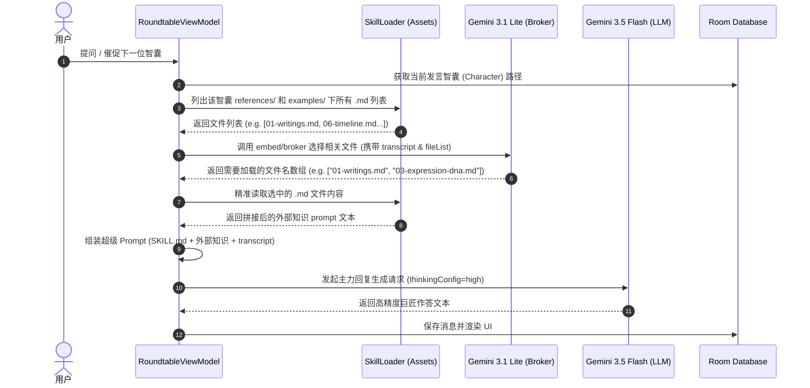

# Gemini 1M 上下文缓存与双模型经纪人（Broker）路由架构 (gemini-1m-context-broker.md)

本文件详述了 **AI 智囊圆桌** 中，利用 Gemini 1M 超长上下文与双模型经纪人（Broker Router）机制进行知识选择性加载的解决方案与技术规格。该方案旨在通过低成本模型进行前置知识检索，并以高保真度模型完成深度脑暴输出。

---

## 1. 背景与设计痛点

### 1.1 纯本地 RAG 的劣势
虽然本地 RAG（通过分块与向量匹配）能节约 Token，但在 Android 手机上集成向量数据库（如 SQLite-VS / Room Vector）会导致 APK 严重增重，且无法处理跨文档的主题连贯性。

### 1.2 完整拼接（Few-shot + 知识库）的瓶颈
每个智囊角色的 `references/` 包含多种维度的文档（如历史决策、生平年表、风格分析、著作摘录）。如果将 150KB 的全部文档在每次请求时无脑喂给 LLM：
1. **上下文污染**：不相干的历史年表或决策细节会稀释模型对当前问题的专业专注度。
2. **缓存抖动**：因为输入内容频繁改变，会导致 Gemini 系统的 Context Cache 频繁失效，反而增加了请求成本和延迟。

---

## 2. 核心架构：双模型经纪人（Broker Router）模式

为了闭合与电脑端的质量差距，本 App 采用 **Gemini 3.1 Lite 作为知识经纪人，Gemini 3.5 Flash 作为发声巨匠** 的双模型协作流水线。

```
                         用户提交提问 (Query)
                                  ↓
                        【 阶段一：前置智能检索 】
                 1. 列出当前智囊 assets/skills/ 下的
                    所有 references/*.md 和 examples/*.md 文件名
                                  ↓
                 2. 发送请求给 gemini-3.1-flash-lite-preview (速度快、资费低)
                    询问：“基于此问题与上下文，该选择加载哪几个参考文件？”
                                  ↓
                 3. 3.1 Lite 以高精度输出 JSON 文件列表 (e.g. ["01-writings.md"])
                                  
------------------------------------------------------------------------

                        【 阶段二：动态装载与生成 】
                 4. Kotlin 在本地 assets 中精准读取被选中的 Markdown 文件
                                  ↓
                 5. 拼接：SKILL.md (设定) + 选中的 md (专业知识库) + 会议上下文
                                  ↓
                 6. 发送请求给 gemini-3.5-flash (High 强度深度推理)
                                  ↓
                        返回智囊的高保真圆桌作答
```

---

## 3. 经纪人（Broker）接口与 Prompt 设计

### 3.1 3.1 Lite 请求端点
使用 `gemini-3.1-flash-lite-preview` 专用模型接口，由于 3.1 Lite 具备优异的 JSON 结构化输出能力，能 100% 稳定生成目标格式。

### 3.2 Broker Prompt 模板
```markdown
你是一个知识检索经纪人 (Broker)。
请阅读以下会议脑暴上下文，并从候选资料文件列表中选择对回答当前问题“最紧密相关、最必要”的 1 到 10 个参考文件。

【会议脑暴上下文】
$transcript

【候选资料文件列表】
$fileList

【输出格式】
你必须返回一个 JSON 数组，包含需要加载的文件名。不要包含任何 Markdown 格式包裹（如 ```json 标记），直接输出纯 JSON 字符串。
示例：["01-writings.md", "03-expression-dna.md"]
```

---

## 4. 系统时序图 (Sequence Diagram)



---

## 5. 缓存与性能效益
- **Context Caching 命中率翻倍**：由于 3.1 Lite 对资料进行了选择性过滤，某一个主题（如“职业规划”）下，连续几个角色的 systemPrompt 中拼接的参考文件（如 `zhang_xuefeng/01-writings.md` 等）完全一致，这会**高概率触发 Gemini Server 的上下文缓存**，使响应速度提升 2-3 倍，极大地节约了 Key 池的请求额度。
- **免去本地向量库**：完全脱机读取 assets 列表，路由逻辑交给云端 3.1 Lite 处理，APK 零增重。
