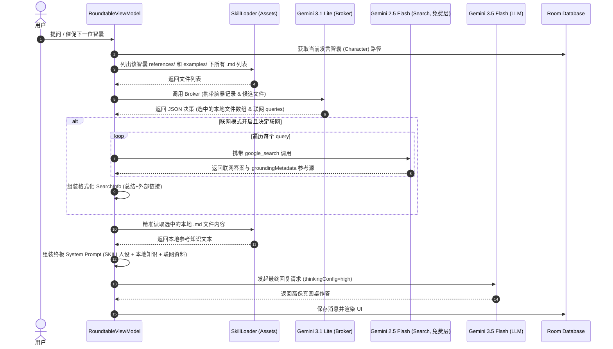

# Gemini 1M 上下文缓存与三模型级联经纪人（Broker）路由架构 (gemini-1m-context-broker.md)

本文件详述了 **AI 智囊圆桌** 中，利用 Gemini 1M 超长上下文与三模型级联经纪人机制进行本地知识选择性加载与实时联网接地搜索的协同架构。该方案通过 3.1lite 模型完成本地文件检索及联网决策，通过 2.5flash 模型（免费层）配合 google_search 开启多路联网接地，最终通过主力 3.5flash 完成深度思考与圆桌整合回答。

---

## 1. 背景与设计痛点

### 1.1 纯本地 RAG 的劣势
虽然本地 RAG（通过分块与向量匹配）能节约 Token，但在 Android 手机上集成向量数据库（如 SQLite-VS / Room Vector）会导致 APK 严重增重，且无法处理跨文档的主题连贯性。

### 1.2 完整拼接（Few-shot + 知识库）的瓶颈
每个智囊角色的 `references/` 包含多种维度的文档（如历史决策、生平年表、风格分析、著作摘录）。如果将 150KB 的全部文档在每次请求时无脑喂给 LLM：
1. **上下文污染**：不相干的历史年表或决策细节会稀释模型对当前问题的专业专注度。
2. **缓存抖动**：因为输入内容频繁改变，会导致 Gemini 系统的 Context Cache 频繁失效，反而增加了请求成本和延迟。
3. **实时现实接地（Grounding）需求**：当用户询问的问题涉及近期时效性、最新前沿新闻或需要严谨的数据校对时，纯靠静态知识库往往会产生幻觉。我们需要高概率的、多模式可调的 Google 搜索来引入实时接地事实。

---

## 2. 核心架构：三模型级联与联网配合模式

为了闭合与电脑端的回答深度差距，并获取实时前沿事实，本 App 采用 **Gemini 3.1 Lite (双决策路由) + Gemini 2.5 Flash (联网接地，免费层) + Gemini 3.5 Flash (高思考回答)** 的三模型级联协作流水线：

```
                         用户提交提问 (Query)
                                  ↓
                        【 阶段一：本地检索与联网双决策 】
                 1. 列出当前智囊 assets/skills/ 下 of
                    所有 references/*.md 和 examples/*.md 文件名
                                  ↓
                 2. 发送请求给 gemini-3.1-flash-lite-preview (低延迟、低成本)
                    进行本地资料加载与是否需要联网搜索的双重判定
                                  ↓
                 3. 3.1 Lite 输出 JSON 决策结构 (SelectedFiles 数组与 SearchQueries 数组)
                                  
------------------------------------------------------------------------

                        【 阶段二：多路联网搜索接地 】
                 4. 若决定联网（或处于强制联网模式），遍历 SearchQueries
                                  ↓
                 5. 多路调用 gemini-2.5-flash (配置 google_search tool 联网工具，使用免费层)
                                  ↓
                 6. 提取 2.5flash 联网总结与 groundingMetadata 引用链接，拼成 SearchInfo
                                  
------------------------------------------------------------------------

                        【 阶段三：动态融合与思考生成 】
                 7. 从本地 assets 加载选中的 md，并与 SearchInfo 合并
                                  ↓
                 8. 拼接：人设 Prompt + 本地知识资料 + 联网接地资料 + 会议脑暴上下文
                                  ↓
                 9. 发送请求给 gemini-3.5-flash (High 强度深度推理，进行高思考度回答)
                                  ↓
                        返回智囊的高保真整合圆桌作答
```

---

## 3. 经纪人（Broker）接口与 Prompt 设计

### 3.1 3.1 Lite 请求端点
使用 `gemini-3.1-flash-lite-preview` 专用模型接口，因其具备优秀的结构化 JSON 产生能力。

### 3.2 智能决策 (SMART) Prompt 模板
```markdown
你是一个知识检索与联网决策代理 (Broker)。
请分析当前的会议脑暴上下文，并作出以下两项决策：
1. 本地资料加载决策：从下方的【候选本地资料文件列表】中，选择回答当前问题最紧密相关、最必要的参考文件（如果列表为空，则返回空数组）。
2. 联网搜索接地决策：判断当前问题或脑暴上下文是否需要最新的实时信息、新闻、外部事实数据来辅助解答。如果需要，请将 `needSearch` 设为 `true`，并在 `searchQueries` 数组中提供 1 到多个精准的搜索关键词（建议 1-3 个）。如果不需要，请将 `needSearch` 设为 `false` 且 `searchQueries` 设为空数组。

【会议脑暴上下文】
$transcript

【候选本地资料文件列表】
$fileList

【输出规范】
你必须返回一个符合以下 JSON 格式的纯 JSON 字符串。不要包含任何 Markdown 格式包裹（例如不要使用 ```json 或 ``` 标记），直接输出 JSON 内容。

JSON 格式示例：
{
  "selectedFiles": ["01-writings.md"],
  "needSearch": true,
  "searchQueries": ["2026年最新大语言模型发布情况", "Gemini 2.5 flash 新特性"]
}
```

---

## 4. 系统时序图 (Sequence Diagram)



---

## 5. 缓存与性能效益
- **Context Caching 高命中**：本地过滤后的 Few-shots / References 文件可保持高重合度，使同一个主题对话多次触发 Gemini 的隐式上下文前缀缓存，降低请求耗时。
- **UI 多级模式保障**：通过 `SearchMode`，用户在离线或 API 额度紧张时，可一键切换至 `OFF`（完全不联网，只用本地资料），也可以切换到 `FORCE`（强制调用 2.5flash 免费层实施最新前沿事实索取），或保持 `SMART`（完全交给 3.1lite 自适应抉择）。
- **无感本地合并**：联网获取的元数据和本地数据都在本地 Kotlin 逻辑层面拼装完成，不增加本地向量库对包体的负荷。
