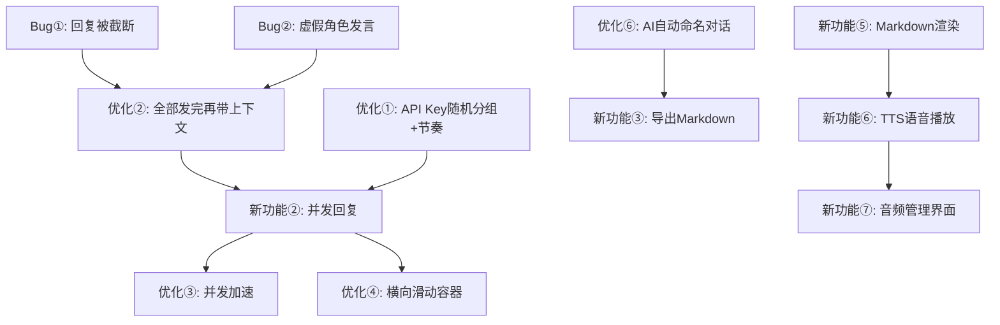

# AI 智囊圆桌 — 功能迭代总计划（v2.0）

本次迭代包含 **6 项新功能**、**6 项优化**、**2 项 Bug 修复**，整体分为 4 个交付波次（Wave），确保相互依赖的功能同步落地。

---

## ⚠️ User Review Required

> [!NOTE]
> **新功能⑥（TTS 语音播放）**使用 Gemini 3.1 Flash Live Preview，WebSocket 协议与当前 Retrofit REST 架构不同，需要单独的 LiveApiClient 实现。已确认：**放入 Wave 4 最后交付**。

> [!NOTE]
> **优化议题①（API Key 并发绑定）**：已确认采用**随机分组**策略，每次会话开始时随机将角色分配到各 Key 组（每组 1~3 个角色）。同一 Key 组内串行执行，不同 Key 组间并发执行。

> [!NOTE]
> **优化议题②（全部发完才加入上下文）** 是对当前发言流的根本性重构，`runRoundtable()` 函数需完全改写，会影响 Bug 2 的修复。已确认：**两者捆绑在同一个 Wave 处理**。

---

## Open Questions

1. **音频持久化格式**：新功能⑥中，Gemini Live 输出 PCM/WAV，是在端上转码为 `.aac`（Android 原生支持，体积小）保存，还是直接保存 `.wav`（无需转码但体积较大）？

> ✅ **已确认**：首次播放直接保存 `.wav`（无需等待转码）；用户在音频库界面手动触发 WAV→AAC 转码，WAV 删除后 ID 不变。

---

## 功能依赖关系图



---

## 分 Wave 交付计划

---

## Wave 1 — Bug 修复 + 上下文重构（基础稳定层）

> **目标**：消灭影响核心体验的 Bug，并重构发言上下文逻辑，为并发奠基。

### Bug①：AI 角色回复内容被截断

**根因推断**：`maxOutputTokens` 配置过低，或 OkHttp 60s 读取超时被触发。

**修复方案**：
- 将 `GenerationConfig.maxOutputTokens` 提高至 `8192`
- 将 `OkHttpClient.readTimeout` 从 60s 提高至 **120s**
- 在 `callGeminiApi()` 中增加 `finishReason` 检查，若为 `MAX_TOKENS` 则追加提示词「请继续」续写

**涉及文件**：
- [`GeminiApi.kt`](file:///d:/My_Elio/AI-Skill-Roundtable/app/src/main/java/com/example/skillroundtable/network/GeminiApi.kt#L123-L130)
- [`RoundtableViewModel.kt`](file:///d:/My_Elio/AI-Skill-Roundtable/app/src/main/java/com/example/skillroundtable/viewmodel/RoundtableViewModel.kt)

---

### Bug②：第一位角色发言中出现虚假其他角色发言记录

**根因推断**：当前 `runRoundtable()` 把前面角色的发言附加到 prompt 里，导致 Lite Broker 模型可能幻觉生成"预期的其他角色发言"混入系统提示。

**修复方案**：与「优化议题②」捆绑修复，详见下方。

---

### 优化议题②（捆绑修复）：第一轮全员发完才带上下文

**旧行为**：角色 A 发完 → 角色 B 的 prompt 包含 A 的回答（链式依赖，顺序执行）

**新行为**：
- **第一轮**：所有角色并发发言，prompt 只包含「用户问题 + 角色自身系统提示」，不包含其他角色发言
- **第二轮起**：所有角色看到完整「用户问题 + 上一轮所有角色发言」上下文再作答

```kotlin
// 新逻辑伪代码
suspend fun runRoundtable(userQuestion: String, round: Int) {
    val contextMessages = if (round == 1) {
        buildFirstRoundPrompt(userQuestion)       // 第一轮：只有用户问题
    } else {
        buildSubsequentRoundPrompt(userQuestion, previousRoundMessages) // 第二轮起：完整上下文
    }
    // 并发触发所有角色（详见 Wave 2）
}
```

**Action Items**:
- [ ] 在 `Message` 表增加 `roundIndex: Int` 字段，区分第几轮发言（Room Migration v3→v4）
- [ ] 重写 `runRoundtable()` 为并发模式
- [ ] 修改 prompt 拼装逻辑：第一轮不注入其他角色发言，第二轮注入上一轮完整发言

**涉及文件**：
- [`ChatSession.kt`](file:///d:/My_Elio/AI-Skill-Roundtable/app/src/main/java/com/example/skillroundtable/data/ChatSession.kt) — `Message` 实体新增 `roundIndex` 字段
- [`RoundtableViewModel.kt`](file:///d:/My_Elio/AI-Skill-Roundtable/app/src/main/java/com/example/skillroundtable/viewmodel/RoundtableViewModel.kt) — 重构 `runRoundtable()`

---

## Wave 2 — 并发架构 + UI 视觉重构

> **目标**：实现并发发言（新功能②）、API Key 随机分组+反检测节奏（优化①）、横向滑动 UI（优化④）、导航栏减高（优化⑤）、AI 自动命名（优化⑥）。

### 新功能② × 优化③：多角色并发回复

**当前状态**：角色一个一个顺序回复，速度慢。  
**目标状态**：不同 Key 组的角色**跨组并发**发起请求；同一 Key 组内角色**串行**执行，最大化利用前缀缓存。

**UI 表现**：
- 并发期间，所有参与角色的气泡显示「✦ 正在思考...」动画
- 每个角色回复完成后，气泡内容即时更新（不等待全部完成）
- 全部完成后，触发下一轮（若开启自动下一轮）

**涉及文件**：
- `RoundtableViewModel.kt` — `_typingCharacterId` 升级为 `_typingCharacterIds: Set<String>`
- `MainActivity.kt` — 气泡 UI 响应多角色 typing 状态

---

### 优化议题① + 补充：API Key 随机分组 × 反检测请求节奏

**分组策略（已确认：随机分组）**：
- 每次会话开始时，将参与角色**随机打乱**后，每 1~3 个随机分配给一个可用 API Key
- 同一 Key 内的角色：**严格串行**（同时只有一个角色在调用该 Key）
- 不同 Key 之间的角色组：**并发执行**（跨组无限制）

**反检测请求节奏（新增优化）**：

| 场景 | 策略 | 随机范围 |
|------|------|----------|
| 用户发言后，各 Key 组开始第一次请求 | 每个 Key 组**随机延迟后错开启动** | **1~3 秒** |
| 同一 Key 下，上一角色发完 → 下一角色开始 | **随机等待**后再发起下一个请求 | **2~6 秒** |

```kotlin
// 并发调度伪代码
coroutineScope {
    val shuffledChars = selectedCharacters.shuffled()
    val groups = shuffledChars.chunked((1..3).random()) // 随机每组 1~3 人
    groups.forEachIndexed { groupIdx, group ->
        val groupKey = availableKeys[groupIdx % availableKeys.size]
        launch {
            delay((1000L..3000L).random()) // 各组错开起始时间 1~3s
            group.forEachIndexed { charIdx, character ->
                if (charIdx > 0) delay((2000L..6000L).random()) // 组内角色串行间隔 2~6s
                callGeminiApi(character, prompt, groupKey)
            }
        }
    }
}
```

**涉及文件**：
- [`ApiKeyPool.kt`](file:///d:/My_Elio/AI-Skill-Roundtable/app/src/main/java/com/example/skillroundtable/network/ApiKeyPool.kt) — 新增 `assignRandomGroups(characters, availableKeys)` 函数
- `RoundtableViewModel.kt` — 调用时按随机分组 + 延迟策略编排

---

### 优化议题④：同一轮言论横向滑动容器

**UI 方案**：
- 每一轮发言使用 `HorizontalPager`（Compose）包裹
- 每个角色的发言卡片作为一个「页面」，支持左右滑动
- 页面指示器（圆点/角色头像小图标）显示在底部
- 竖向滚动轴保持当前页面内的内容滚动

**涉及文件**：
- `MainActivity.kt` — 消息列表渲染逻辑，按 `roundIndex` 分组后渲染横向滑动容器

---

### 优化议题⑤：导航栏减高 15%

- 找到底部导航栏 `BottomNavigation` / `NavigationBar` composable
- 将 `modifier.height(...)` 或内边距统一缩减 15%
- 调整角色头像尺寸与文字字号同比缩小

**涉及文件**：
- `MainActivity.kt` — 底部导航区域

---

### 优化议题⑥：AI 自动命名对话标题

**方案**：
- 用户发送第一个问题后，异步使用 `gemini-3.1-flash-lite-preview` 生成简短标题（≤15 字）
- 成功后调用 `chatRepo` 更新 `ChatSession.title`
- 支持用户**长按**对话标题进入重命名弹窗（`AlertDialog` + `TextField`）

**涉及文件**：
- `RoundtableViewModel.kt` — 新增 `generateSessionTitle(sessionId, firstQuestion)` 函数
- [`ChatSession.kt`](file:///d:/My_Elio/AI-Skill-Roundtable/app/src/main/java/com/example/skillroundtable/data/ChatSession.kt) — 新增 `updateSessionTitle(id, title)` DAO 方法
- `MainActivity.kt` — 对话列表 + 顶栏标题支持长按重命名

---

## Wave 3 — 内容增强（Markdown 渲染 + 导出 + Debug 面板）

> **目标**：提升阅读体验，支持内容导出，提供开发调试能力。

### 新功能⑤：角色发言 Markdown 渲染

**方案**：
- 引入 [`compose-markdown` by jeziellago](https://github.com/jeziellago/compose-markdown)（纯 Compose，无需 WebView）
- 渲染内容：标题、加粗、斜体、代码块、列表、引用
- 每条发言气泡右上角保留「复制全文」图标按钮

**涉及文件**：
- `app/build.gradle.kts` — 添加 Markdown 依赖
- `MainActivity.kt` — 替换 `Text()` 为 `MarkdownText()` 组件

---

### 新功能③：对话导出 Markdown

**方案**：
- 工具栏新增「导出」按钮（📄 图标）
- 弹出 BottomSheet 选择：
  1. **复制到剪贴板** — 生成 Markdown 字符串复制
  2. **保存到本地文档** — 使用 `MediaStore` 保存到 `Documents/AI智囊圆桌/` 目录
- Markdown 格式示例：
  ```markdown
  # 对话标题
  **时间**：2026-07-13
  
  ## 用户提问
  > 你的问题内容
  
  ## 第一轮发言
  ### 🚀 埃隆·马斯克
  回复内容...
  
  ### 🧠 费曼
  回复内容...
  ```

**涉及文件**：
- `RoundtableViewModel.kt` — 新增 `exportConversation(sessionId): String` 函数
- `MainActivity.kt` — 导出按钮 + BottomSheet UI

---

### 新功能④：Debug 面板（API 后台使用情况查看）

**方案**：
- 在设置页面或顶部菜单增加「Debug」入口（仅 Debug 构建显示）
- Debug 面板显示：
  - 当前会话绑定的 API Key ID
  - 每个 Key 的状态：可用 / 已熔断（剩余熔断时间）
  - 最近 N 条 API 请求日志（模型名、请求时间、响应时间、状态码）
  - 最近发送的完整 Prompt（折叠展开）
  - 各 Key 组的随机分组情况（角色→Key 的映射）

**涉及文件**：
- `network/ApiKeyPool.kt` — 暴露 Key 状态查询接口
- `MainActivity.kt` — Debug 面板 Composable
- `RoundtableViewModel.kt` — 新增 `apiDebugLogs: StateFlow<List<ApiLog>>` 状态

---

## Wave 4 — 语音播放 + 音频管理（TTS 层）

> **目标**：为每条发言提供 AI 语音朗读（WAV 直存，无需等待转码），并建立独立的音频资产管理界面（支持按需 WAV→AAC 转码压缩）。

### 新功能⑥：点击播放角色言论（TTS）

**技术方案**：
- 使用 [Gemini Live API](https://ai.google.dev/gemini-api/docs/models/gemini-3.1-flash-live-preview) 的文字→音频模式
- 接口协议：WebSocket（非 REST），需要独立的 `LiveApiClient.kt`
- **音频格式策略（两阶段）**：
  - 🔵 **第一次播放**：直接接收 PCM 流 → 保存为 `.wav`（无转码等待，立即可播）
  - 🟢 **按需转码**：用户在音频库界面手动触发 `.wav → .aac`，转码成功后原 `.wav` 自动删除，Room 中 `audioFilePath` 更新为 `.aac` 路径，`messageId` 保持不变
- 播放流程：
  1. 用户点击发言气泡旁「🔊」按钮
  2. 检查本地是否已缓存该消息的音频（`.wav` 或 `.aac`，以 `messageId` 为文件名）
  3. 若已缓存 → 直接播放（`MediaPlayer`）
  4. 若未缓存 → 发起 Live API 请求，接收 PCM 音频流 → 写入 `.wav` → 立即播放
- 音频存储路径：
  - 原始 WAV：`files/audio/<messageId>.wav`
  - 转码 AAC：`files/audio/<messageId>.aac`（转码后取代 wav，ID 相同）

---

### 角色专属声音配置（预先内置至 `skills_config.json`）

> 基于 Gemini Live API 30 个预置声音，按角色气质精心匹配：

| 角色 ID | 角色名 | 分配声音 | 声音特质 | 选择理由 |
|---------|--------|----------|----------|---------|
| `zhang_xuefeng` | 张雪峰 | **Orus** | Firm（坚定） | 直接、接地气、有力量感，贴合张雪峰实用主义导师气质 |
| `elon_musk` | 埃隆·马斯克 | **Fenrir** | Excitable（亢奋） | 充满能量、激进、快节奏，匹配马斯克的狂热创业者形象 |
| `feynman` | 费曼 | **Sadaltager** | Knowledgeable（博学） | 清晰、权威、有深度，体现费曼解释复杂概念的从容感 |
| `charlie_munger` | 查理·芒格 | **Gacrux** | Mature（成熟） | 厚重、老练、沉稳，完美匹配芒格的长者哲人气质 |
| `naval_ravikant` | Naval Ravikant | **Charon** | Informative（信息型） | 冷静、有逻辑、富有洞察力，契合 Naval 的思考者风格 |
| `steve_jobs` | 史蒂夫·乔布斯 | **Kore** | Firm（坚定） | 强势、简洁、有感染力，呼应 Jobs 的 Reality Distortion Field |
| `nassim_taleb` | 纳西姆·塔勒布 | **Algenib** | Gravelly（粗犷） | 粗粝、不羁、反叛感，完美匹配塔勒布的特立独行风格 |

**`skills_config.json` 每个角色对象新增字段**：
```json
{
  "voiceConfig": {
    "voiceName": "Orus",
    "speakingRate": 1.0,
    "languageCode": "zh-CN"
  }
}
```

**数据层变更**（Room Migration v4→v5）：
- [`ChatSession.kt`](file:///d:/My_Elio/AI-Skill-Roundtable/app/src/main/java/com/example/skillroundtable/data/ChatSession.kt) — `Message` 实体新增：
  - `audioFilePath: String?` — 当前有效音频路径（`.wav` 或 `.aac`）
  - `audioFormat: String?` — `"wav"` 或 `"aac"`，标记当前格式
  - `audioSizeBytes: Long?` — 音频文件大小（字节），供音频库展示

**涉及文件**：
- 新建 `network/LiveApiClient.kt` — WebSocket 封装，处理 PCM 流接收并写入 `.wav`
- 新建 `AudioPlaybackManager.kt` — 播放控制、缓存检查、格式识别
- 新建 `AudioTranscodeWorker.kt` — 使用 `MediaCodec` 执行后台 WAV→AAC 转码
- `MainActivity.kt` — 发言气泡增加播放按钮（显示格式小标签：`WAV 🔴` / `AAC 🟢`）

---

### 新功能⑦：音频资产管理界面

**UI 设计**：
- 独立页面（新增底部导航 Tab「🎵 音频库」）
- 顶部工具栏：
  - 总计音频大小统计：`WAV: X MB  |  AAC: Y MB  |  合计: Z MB`
  - 「📦 全部转码」批量按钮（将所有 WAV 转为 AAC）
  - 「🗑 清空全部音频」按钮
- 每条记录显示：
  - 原始用户问题（引用样式，`> 问题内容`）
  - 角色头像 + 角色名
  - 发言**全文**，默认收起仅显示前 50 字，点击「展开 ▾」按钮显示完整内容，再点「收起 ▴」折回
  - 音频状态标签：`WAV 原始 · 2.4 MB` 或 `AAC 已压缩 · 0.3 MB`
  - 音频播放进度条 + 播放/暂停按钮
  - **转码按钮**（仅 WAV 格式显示）：「🗜️ 转为 AAC」
    - 点击后显示转码进度，完成后更新标签为 AAC，原 WAV 文件自动删除
    - 同一 `messageId` 不变，Room 数据同步更新 `audioFilePath`、`audioFormat`、`audioSizeBytes`
  - **删除菜单**（长按或右上角 ⋮）：
    - 仅删除音频文件（保留文字记录，清空 `audioFilePath`）
    - 删除音频 + 角色发言（整条 Message 记录从数据库删除）

**涉及文件**：
- 新建 `AudioLibraryScreen.kt`（Composable）
- `RoundtableViewModel.kt` — 新增 `audioMessages: StateFlow<List<Message>>` + 转码触发函数 `transcodeAudio(messageId)`
- `MainActivity.kt` — 路由增加音频库页面

---

## 数据库迁移路线图

| 版本 | 变更内容 | Wave |
|------|---------|------|
| v3 → v4 | `Message` 增加 `roundIndex: Int DEFAULT 0` | Wave 1 |
| v4 → v5 | `Message` 增加 `audioFilePath TEXT NULL`、`audioFormat TEXT NULL`、`audioSizeBytes INTEGER NULL` | Wave 4 |

---

## 技术风险评估

| 风险项 | 等级 | 缓解方案 |
|--------|------|----------|
| Gemini Live API WebSocket 集成复杂度 | 🔴 高 | WAV 直存无需实时转码，降低首次集成难度；后续转码用 Android 原生 `MediaCodec` |
| 横向滑动 + 竖向滚动手势冲突 | 🟡 中 | 使用 `HorizontalPager` 官方组件，内置手势冲突处理 |
| 并发请求 429 触发熔断级联 | 🟡 中 | 随机分组 + 组内串行 + 随机起始延迟，各组独立熔断不互相影响 |
| Markdown 库与 Compose 版本兼容性 | 🟢 低 | 选用 `compose-markdown` 库，已验证兼容当前 Compose BOM |
| WAV 音频体积大占用存储空间 | 🟢 低 | 用户可在音频库随时手动转码；顶部实时展示 WAV/AAC 总大小提示用户 |

---

## Verification Plan

### 每个 Wave 完成后执行
```powershell
# 设置 JDK 17 环境（请替换为您的实际 JDK 路径）
$env:JAVA_HOME = "C:\path\to\jdk-17"
$env:Path = "$env:JAVA_HOME\bin;" + $env:Path
.\gradlew.bat compileDebugKotlin   # 零错误
.\gradlew.bat assembleDebug        # 生成 APK
```

### 手动验收清单

- [ ] **Wave 1**：发言不再被截断；第一位角色发言中不出现虚假其他角色内容
- [ ] **Wave 2**：7 个角色同时出现「正在思考」气泡；不同 Key 组间并发、同组内串行可在 Debug 面板观测延迟；同一轮发言可左右横向滑动
- [ ] **Wave 3**：发言内容正确渲染 `**加粗**`、`# 标题`、代码块；导出 Markdown 文件可在文件管理器打开；Debug 面板可查看 Key 状态和请求日志
- [ ] **Wave 4**：
  - 点击 🔊 后首次播放，`.wav` 文件生成并立即播放（无转码等待）
  - 再次点击播放无需重新请求 API（直接读缓存）
  - 每个角色播放时声音风格与气质匹配（Fenrir=马斯克激进 / Gacrux=芒格沉稳 / Algenib=塔勒布粗粝 等）
  - 音频库界面：WAV 显示🔴标签、AAC 显示🟢标签
  - 转码后 WAV 文件被删除、`messageId` 不变、Room 数据同步更新
  - 音频库顶部正确统计 WAV/AAC 各自大小和合计
